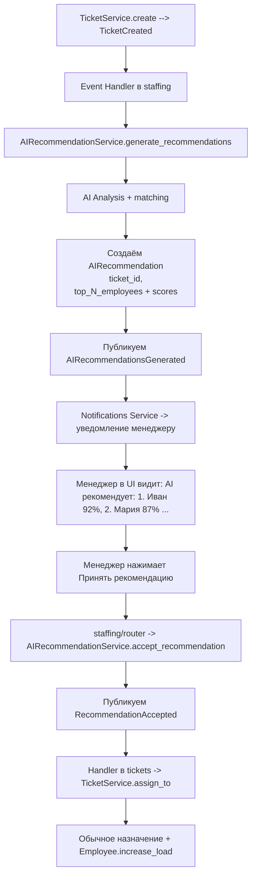

# Подбор исполнителей с использованием AI

## Полный FLOW процесса

```mermaid
graph TD
    A[TicketService.create --> TicketCreated] --> B[Event Handler в staffing]
    B --> C[AIRecommendationService.generate_recommendations]
    C --> D[AI Analysis + matching]
    D --> E[Создаём AIRecommendation<br/> ticket_id, top_N_employees + scores]
    E --> F[Публикуем AIRecommendationsGenerated]
    F --> G[Notifications Service -> уведомление менеджеру]
    G --> H[Менеджер в UI видит: AI рекомендует: 1. Иван 92%, 2. Мария 87% ...]
    H --> I[Менеджер нажимает Принять рекомендацию ]
    I --> J[staffing/router -> AIRecommendationService.accept_recommendation]
    J --> K[Публикуем RecommendationAccepted]
    K --> L[Handler в tickets -> TicketService.assign_to]
    L --> M[Обычное назначение + Employee.increase_load]
```
