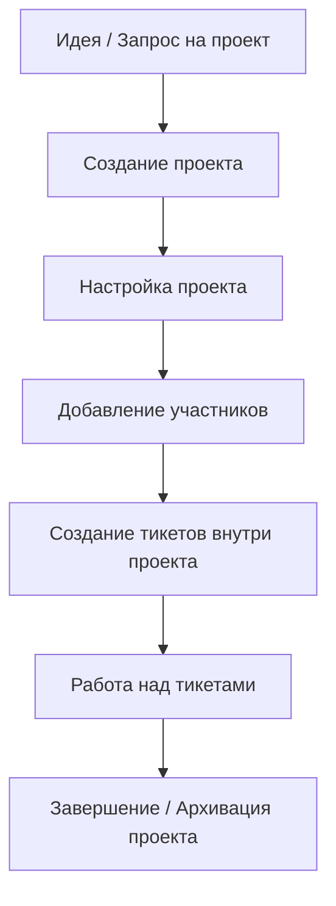
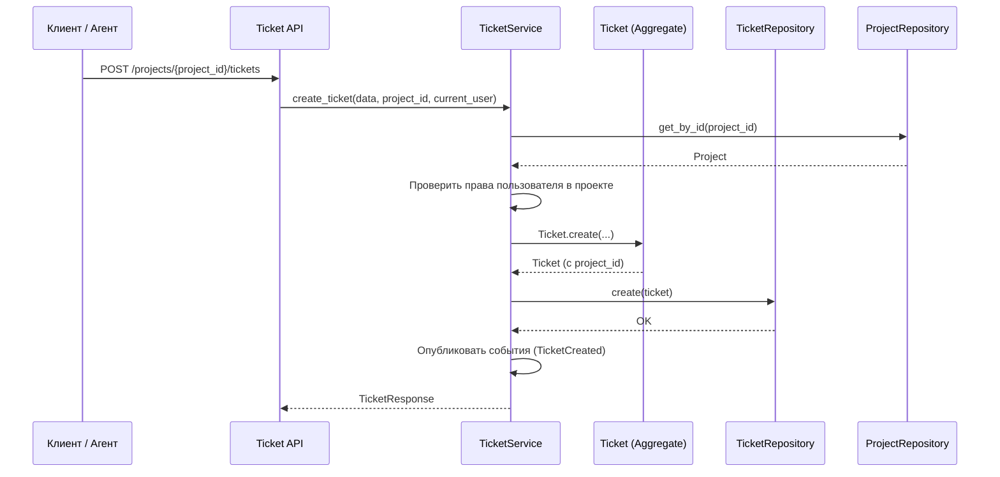

# Жизненный цикл проекта

## Подробное описание жизненного цикла

| Этап            | Кто создаёт / выполняет | Что происходит                                                     | Статус проекта |
|-----------------|-------------------------|--------------------------------------------------------------------|----------------|
| Создание        | Support Manager / Admin | Создаётся проект, указывается название, ключ, контрагент, владелец | ACTIVE         |
| Настройка       | Owner проекта + Manager | Добавляются участники, настраиваются права, workflow (опционально) | ACTIVE         |
| Активная работа | Все участники проекта   | Создаются тикеты, ведётся работа, добавляются комментарии          | ACTIVE         |
| On Hold         | Owner / Manager         | Проект временно приостановлен (например, клиент не отвечает)       | ON_HOLD        |
| Завершение      | Owner / Manager         | Все тикеты закрыты, проект отмечается как завершённый              | COMPLETED      |
| Архивация       | Manager / Admin         | Проект больше не активен, тикеты доступны только для чтения        | ARCHIVED       |

## Взаимодействие клиента с проектом

| Действие                   | Customer         | Customer Admin                     | Support Agent      | Support Manager |
|----------------------------|------------------|------------------------------------|--------------------|-----------------|
| Видеть тикеты проекта      | Только свои      | Все тикеты проекта                 | Все тикеты проекта | Все             |
| Создавать тикеты в проекте | Да               | Да                                 | Да                 | Да              |
| Комментировать тикеты      | Только публичные | Публичные + internal (ограниченно) | Да                 | Да              |
| Назначать исполнителя      | Нет              | Нет                                | Да                 | Да              |
| Менять статус тикета       | Нет              | Нет                                | Да                 | Да              |
| Добавлять других клиентов  | Нет              | Нет                                | Нет                | Да              |

## Создание тикета в проекте

## Правовая матрица 

| Действие                               | OWNER | MANAGER | CONTRIBUTOR | VIEWER | CUSTOMER_MANAGER | CUSTOMER |
|----------------------------------------|:-----:|:-------:|:-----------:|:------:|:----------------:|:--------:|
| Просмотр тикетов                       |  ✅   |   ✅    |     ✅      |   ✅   |       ✅         |    ✅    |
| Создание тикетов                       |  ✅   |   ✅    |     ✅      |   ❌   |       ✅         |    ✅    |
| Назначение тикетов (назначить)         |  ✅   |   ✅    |     ✅      |   ❌   |       ❌         |    ❌    |
| Возможность быть назначенным на тикет  |  ✅   |   ✅    |     ✅      |   ❌   |       ❌         |    ❌    |
| Изменение статуса тикета               |  ✅   |   ✅    |   ⚠️¹      |   ❌   |      ⚠️²        |   ⚠️³   |
| Добавление участников в проект         |  ✅   |   ✅    |   ⚠️⁴      |   ❌   |      ⚠️⁵        |    ❌    |
| Передача владения проектом             |  ✅   |   ❌    |     ❌      |   ❌   |       ❌         |    ❌    |
| Архивирование проекта                  |  ✅   |   ❌    |     ❌      |   ❌   |       ❌         |    ❌    |

**Примечания:**

- ⚠️¹ CONTRIBUTOR может менять статусы: `OPEN`, `IN_PROGRESS`, `WAITING`, `RESOLVED`, `CLOSED`. Запрещено согласование из `PENDING_APPROVAL` и перевод в `REOPENED`.
- ⚠️² CUSTOMER_MANAGER может: переоткрыть (`REOPENED`) или согласовать/отклонить (`PENDING_APPROVAL` → `OPEN`/`REJECTED`) тикеты **своего контрагента**.
- ⚠️³ CUSTOMER может только переоткрыть (`REOPENED`) тикет **своего контрагента**.
- ⚠️⁴ CONTRIBUTOR может добавлять только роли: `CONTRIBUTOR`, `VIEWER`, `CUSTOMER`.
- ⚠️⁵ CUSTOMER_MANAGER может добавлять только роли: `CUSTOMER`, `CUSTOMER_MANAGER`.

**Системные роли (глобальные привилегии):**

- **ADMIN** имеет полный доступ ко всем действиям без ограничений (в том числе передача владения, добавление любых ролей, архивирование).
- **SUPPORT_MANAGER** может создавать и просматривать тикеты, назначать их, менять любые статусы, но **не может** добавлять участников (если не является членом проекта с подходящей ролью) и передавать владение.
- **ACCOUNT_MANAGER** может создавать проекты только с указанием контрагента.
