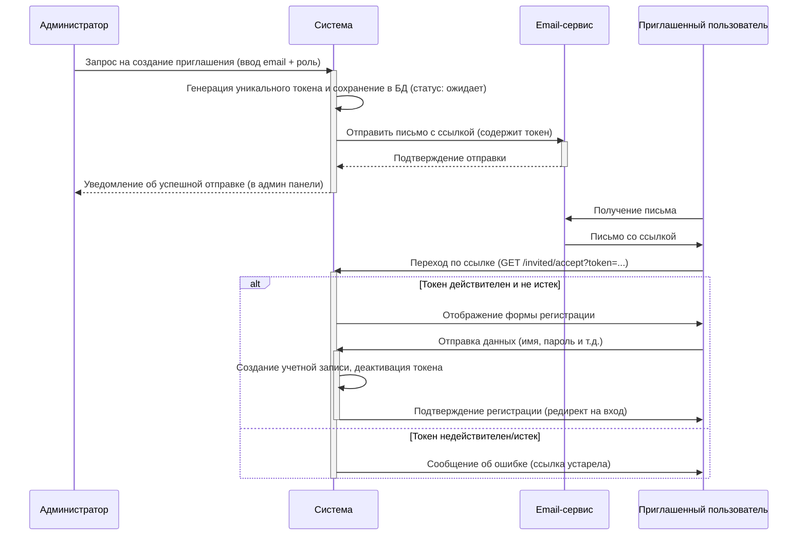

# Процесс регистрации пользователя используя приглашение

```mermaid
sequenceDiagram
    participant Admin as Администратор
    participant System as Система
    participant EmailService as Email-сервис
    participant User as Приглашенный пользователь

    Admin->>System: Запрос на создание приглашения (ввод email + роль)
    activate System
    System->>System: Генерация уникального токена и сохранение в БД (статус: ожидает)
    System->>EmailService: Отправить письмо с ссылкой (содержит токен)
    activate EmailService
    EmailService-->>System: Подтверждение отправки
    deactivate EmailService
    System-->>Admin: Уведомление об успешной отправке (в админ панели)
    deactivate System

    User->>EmailService: Получение письма
    EmailService->>User: Письмо со ссылкой

    User->>System: Переход по ссылке (GET /invited/accept?token=...)
    activate System
    alt Токен действителен и не истек
        System->>User: Отображение формы регистрации
        User->>System: Отправка данных (имя, пароль и т.д.)
        activate System
        System->>System: Создание учетной записи, деактивация токена
        System->>User: Подтверждение регистрации (редирект на вход)
        deactivate System
    else Токен недействителен/истек
        System->>User: Сообщение об ошибке (ссылка устарела)
    end
    deactivate System
```