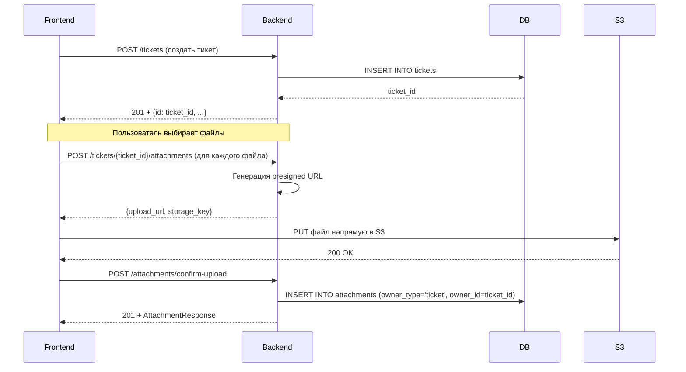

# Flow прикрепления файла к тикету

```mermaid
sequenceDiagram
    participant Frontend
    participant Backend
    participant DB

    Frontend->>Backend: POST /tickets (создать тикет)
    Backend->>DB: INSERT INTO tickets
    DB-->>Backend: ticket_id
    Backend-->>Frontend: 201 + {id: ticket_id, ...}

    Note over Frontend,Backend: Пользователь выбирает файлы

    Frontend->>Backend: POST /tickets/{ticket_id}/attachments (для каждого файла)
    Backend->>Backend: Генерация presigned URL
    Backend-->>Frontend: {upload_url, storage_key}

    Frontend->>S3: PUT файл напрямую в S3
    S3-->>Frontend: 200 OK

    Frontend->>Backend: POST /attachments/confirm-upload
    Backend->>DB: INSERT INTO attachments (owner_type='ticket', owner_id=ticket_id)
    Backend-->>Frontend: 201 + AttachmentResponse
```