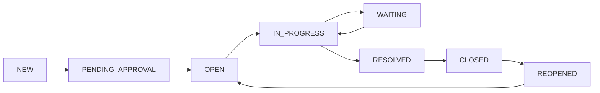

# Жизненный цикл тикета

## Изменение статусов

## Подробное описание статусов и переходов

| Статус           | Кто может поставить      | Что значит                                    | Следующие возможные статусы |
|------------------|--------------------------|-----------------------------------------------|-----------------------------|
| NEW              | Система / Клиент / Агент | Тикет только создан                           | PENDING_APPROVAL, OPEN      |
| PENDING_APPROVAL | Support Agent, Manager   | Тикет создан, но ещё не согласован заказчиком | OPEN, REJECTED              |
| OPEN             | Manager, Agent           | Тикет согласован и готов к работе             | IN_PROGRESS, WAITING        |
| IN_PROGRESS      | Agent, Executor          | Над тикетом активно работают                  | WAITING, RESOLVED           |
| WAITING          | Agent, Executor          | Ждём ответа от клиента / другой стороны       | IN_PROGRESS                 |
| RESOLVED         | Agent, Executor          | Работа выполнена, ждём подтверждения закрытия | CLOSED                      |
| CLOSED           | Agent, Manager           | Тикет закрыт                                  | REOPENED                    |
| REOPENED         | Client, Manager          | Тикет переоткрыт (проблема вернулась)         | OPEN, IN_PROGRESS           |
| REJECTED         | Manager                  | Тикет отклонён (неактуален, дубликат и т.д.)  | CLOSED                      |
