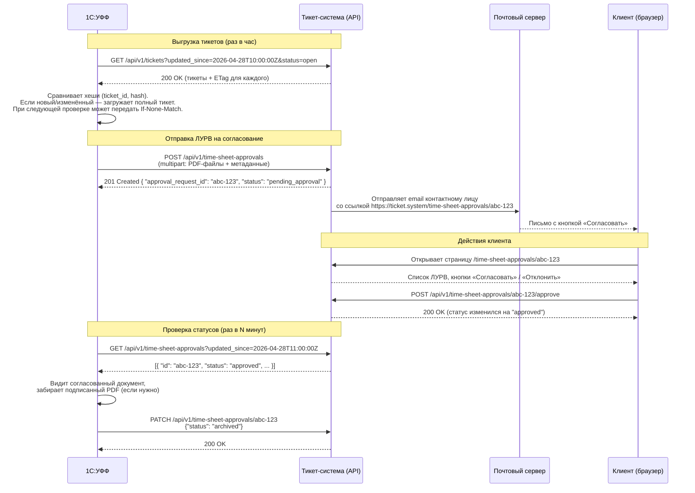

# Интеграция с 1С УФФ

```mermaid
sequenceDiagram
    participant 1C as 1С:УФФ
    participant TicketAPI as Тикет-система (API)
    participant Mail as Почтовый сервер
    participant Client as Клиент (браузер)

    Note over 1C,TicketAPI: Выгрузка тикетов (раз в час)

    1C->>TicketAPI: GET /api/v1/tickets?updated_since=2026-04-28T10:00:00Z&status=open
    TicketAPI-->>1C: 200 OK (тикеты + ETag для каждого)
    1C->>1C: Сравнивает хеши (ticket_id, hash).<br/>Если новый/изменённый — загружает полный тикет.<br/>При следующей проверке может передать If-None-Match.

    Note over 1C,TicketAPI: Отправка ЛУРВ на согласование

    1C->>TicketAPI: POST /api/v1/time-sheet-approvals<br/>(multipart: PDF-файлы + метаданные)
    TicketAPI-->>1C: 201 Created { "approval_request_id": "abc-123", "status": "pending_approval" }
    TicketAPI->>Mail: Отправляет email контактному лицу<br/>со ссылкой https://ticket.system/time-sheet-approvals/abc-123
    Mail-->>Client: Письмо с кнопкой «Согласовать»

    Note over Client,TicketAPI: Действия клиента

    Client->>TicketAPI: Открывает страницу /time-sheet-approvals/abc-123
    TicketAPI-->>Client: Список ЛУРВ, кнопки «Согласовать» / «Отклонить»
    Client->>TicketAPI: POST /api/v1/time-sheet-approvals/abc-123/approve
    TicketAPI-->>Client: 200 OK (статус изменился на "approved")

    Note over 1C,TicketAPI: Проверка статусов (раз в N минут)

    1C->>TicketAPI: GET /api/v1/time-sheet-approvals?updated_since=2026-04-28T11:00:00Z
    TicketAPI-->>1C: [{ "id": "abc-123", "status": "approved", ... }]
    1C->>1C: Видит согласованный документ,<br/>забирает подписанный PDF (если нужно)
    1C->>TicketAPI: PATCH /api/v1/time-sheet-approvals/abc-123<br/>{"status": "archived"}
    TicketAPI-->>1C: 200 OK
```