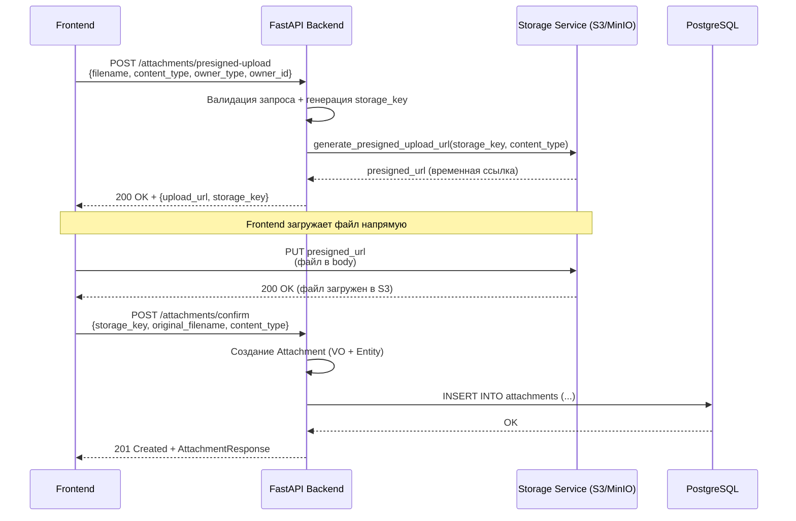

# Bounded context для работы с файлами и вложениями

## Логика загрузки файла на сервер

```mermaid
sequenceDiagram
    participant Frontend
    participant Backend as FastAPI Backend
    participant StorageService as Storage Service (S3/MinIO)
    participant DB as PostgreSQL

    Frontend->>Backend: POST /attachments/presigned-upload<br/>{filename, content_type, owner_type, owner_id}
    Backend->>Backend: Валидация запроса + генерация storage_key
    Backend->>StorageService: generate_presigned_upload_url(storage_key, content_type)
    StorageService-->>Backend: presigned_url (временная ссылка)
    Backend-->>Frontend: 200 OK + {upload_url, storage_key}

    Note over Frontend,StorageService: Frontend загружает файл напрямую

    Frontend->>StorageService: PUT presigned_url<br/>(файл в body)
    StorageService-->>Frontend: 200 OK (файл загружен в S3)

    Frontend->>Backend: POST /attachments/confirm<br/>{storage_key, original_filename, content_type}
    Backend->>Backend: Создание Attachment (VO + Entity)
    Backend->>DB: INSERT INTO attachments (...)
    DB-->>Backend: OK
    Backend-->>Frontend: 201 Created + AttachmentResponse
```
